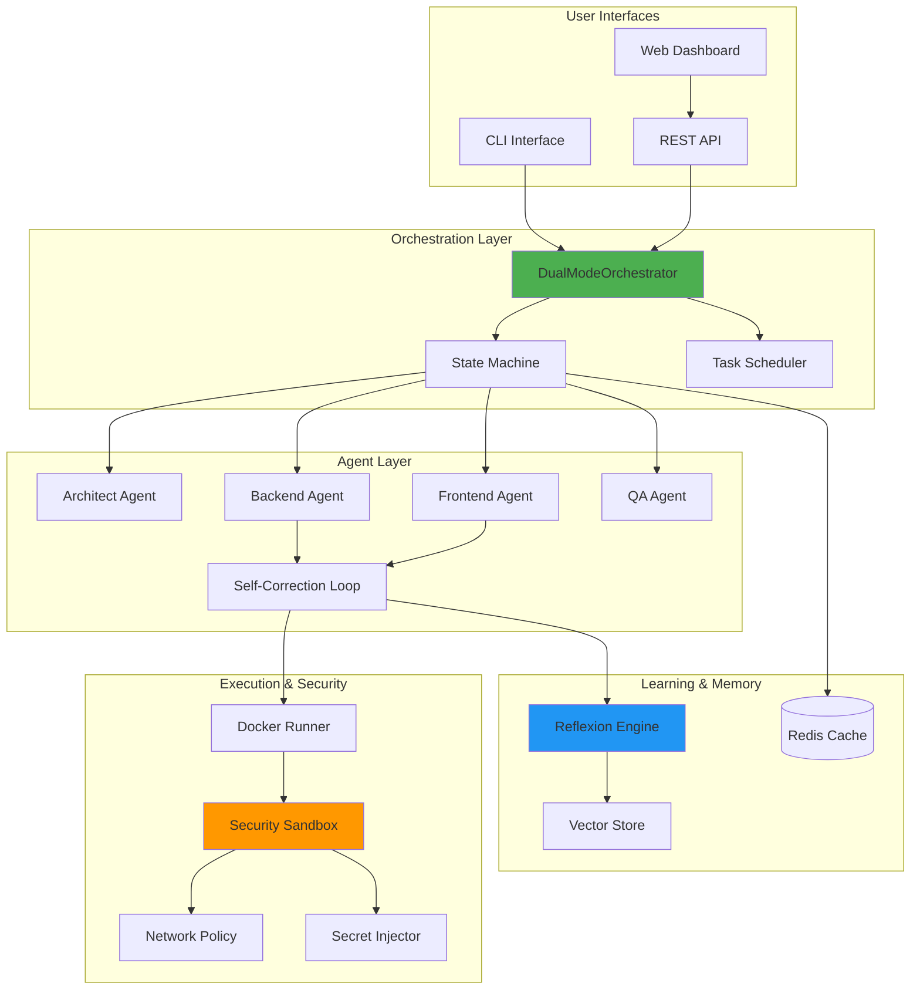
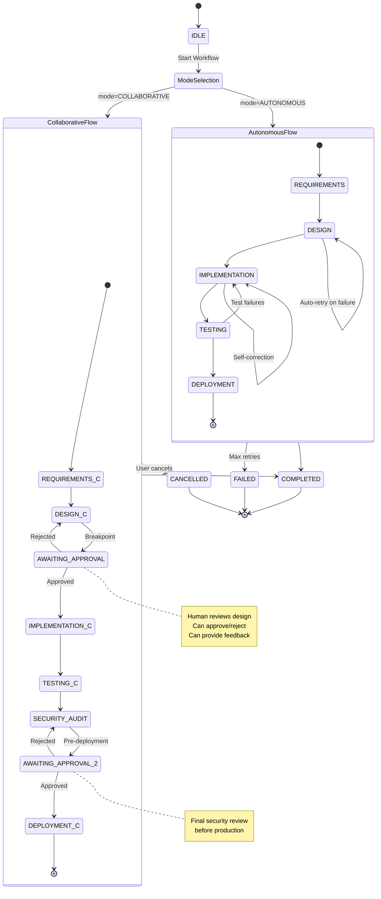
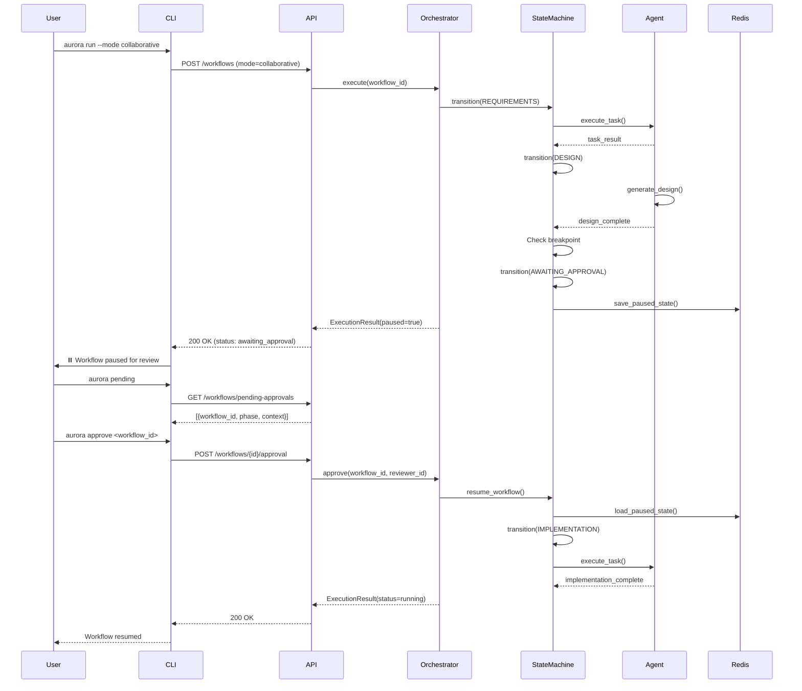
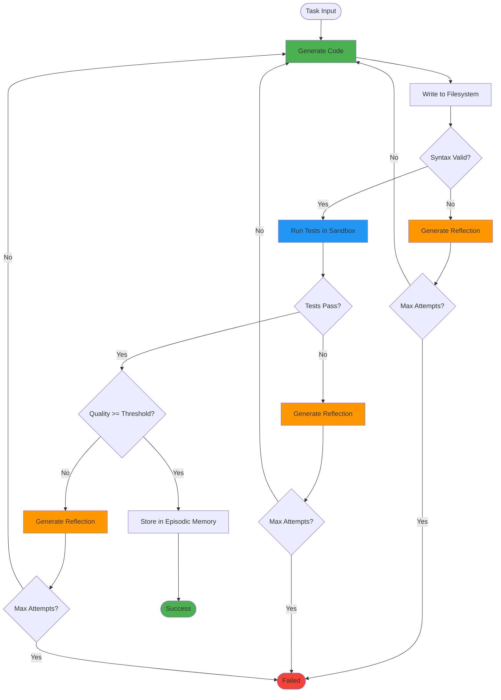
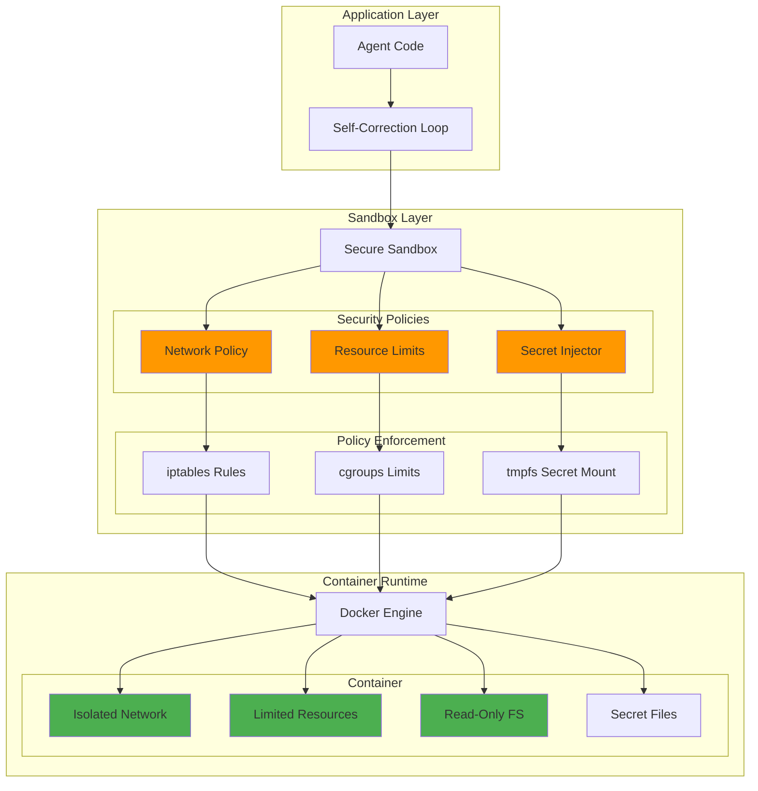
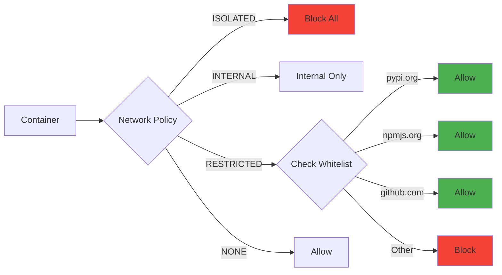
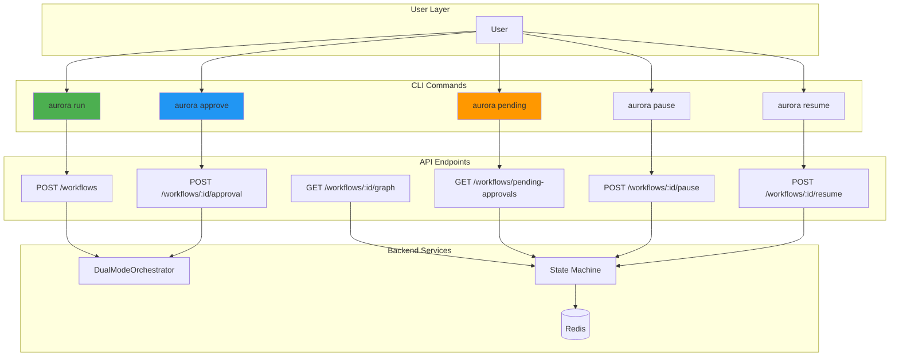
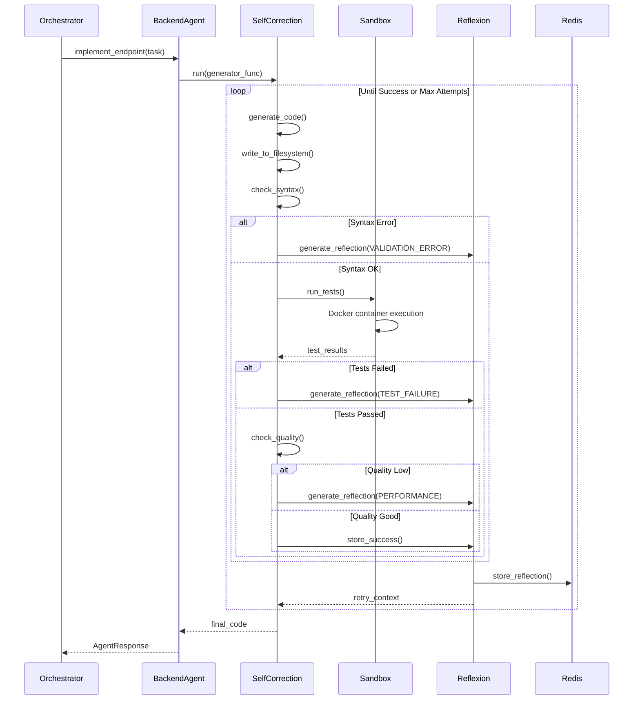

# Aurora-Dev Architecture Diagrams

Comprehensive architecture documentation for the refactored AURORA-DEV multi-agent system.

---

## System Overview

---

## Dual-Mode Orchestration Flow

---

## Human-in-the-Loop Approval Workflow

---

## Self-Correction Loop

---

## Security Sandbox Architecture

### Network Policy Details

---

## CLI and API Integration

---

## Data Flow: Code Generation with Self-Correction

